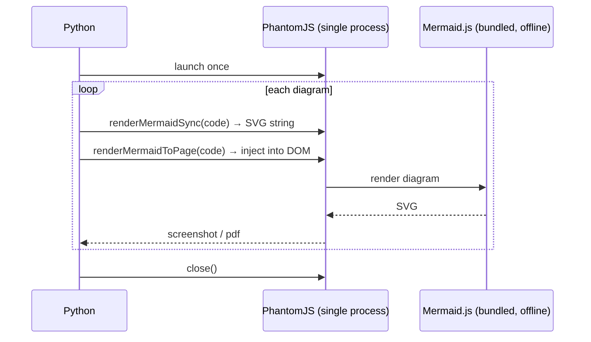

# mmdc — Mermaid Diagram Converter for Python

[](https://pypi.org/project/mmdc)
[](https://pypi.org/project/mmdc)
[](https://opensource.org/licenses/MIT)
[](https://github.com/MohammadRaziei/mmdc/actions/workflows/wheel.yml)

<div align="center">

</div>

Convert Mermaid diagrams to SVG, PNG, and PDF — **fully offline and fast, just `pip install mmdc`**.

No Node.js. No npm. No Chrome. No system packages. Powered by [Phasma](https://github.com/mohammadraziei/phasma/).

---

## Why mmdc?

The official Mermaid CLI (`@mermaid-js/mermaid-cli`) requires Node.js and npm. If you're working in a Python environment, that's a significant dependency just to render a diagram.

`mmdc` brings the same functionality to Python with a single pip install. The Mermaid JS library and PhantomJS binary are both bundled inside the wheel — no network access needed after install.

```bash
pip install mmdc
```

---

## Quick Start

```python
import asyncio
from mmdc import MermaidConverter

DIAGRAM = """
graph TD
    A[Install] --> B[Import]
    B --> C[Convert]
    C --> D[Done]
"""

async def main():
    async with MermaidConverter() as m:
        await m.to_svg(DIAGRAM, "diagram.svg")
        await m.to_png(DIAGRAM, "diagram.png", scale=2.0)
        await m.to_pdf(DIAGRAM, "diagram.pdf")

asyncio.run(main())
```

```bash
mmdc -i diagram.mermaid -o diagram.svg
mmdc -i diagram.mermaid -o diagram.png --scale 2.0
cat diagram.mermaid | mmdc -i - -o diagram.pdf
```

---

## How It Works



One PhantomJS process handles everything — SVG rendering, PNG screenshots, and PDF export all happen inside the same process with no restarts between conversions.

---

## Python API

### `MermaidConverter`

```python
# recommended — automatic lifecycle management
async with MermaidConverter(theme="default", background="white") as m:
    svg = await m.to_svg("graph TD\n    A-->B")

# manual lifecycle
m = MermaidConverter()
await m.start()
svg = await m.to_svg("graph TD\n    A-->B")
await m.close()

# module-level singleton — lazy start, closes at exit
import mmdc
svg = await mmdc.to_svg("graph TD\n    A-->B")
png = await mmdc.to_png("graph TD\n    A-->B", scale=2.0)
```

### Methods

#### `to_svg(source, output?, *, theme?, background?, config?, css?) → bytes`

```python
svg = await m.to_svg("graph TD\n    A-->B")
svg = await m.to_svg(Path("diagram.mermaid"), "out.svg", theme="dark")
```

#### `to_png(source, output?, *, scale?, theme?, background?, config?, css?) → bytes`

```python
png = await m.to_png("graph TD\n    A-->B", scale=2.0)
await m.to_png(Path("diagram.mermaid"), "out.png", scale=3.0, theme="forest")
```

#### `to_pdf(source, output?, *, scale?, theme?, background?, config?, css?, pdf_format?, pdf_landscape?, pdf_margin?) → bytes`

```python
# fit paper to diagram size (default)
pdf = await m.to_pdf("graph TD\n    A-->B")

# standard paper
await m.to_pdf("graph TD\n    A-->B", "out.pdf", pdf_format="A4", pdf_landscape=True)
```

#### `convert(source, output?, ...) → bytes`

Auto-detects format from file extension:

```python
await m.convert(DIAGRAM, "out.svg")   # → SVG
await m.convert(DIAGRAM, "out.png")   # → PNG
await m.convert(DIAGRAM, "out.pdf")   # → PDF
```

### Parameters

| Parameter | Type | Default | Description |
|---|---|---|---|
| `source` | `str \| Path` | — | Mermaid string, `.mermaid` file path, or `Path` object |
| `output` | `str \| Path \| None` | `None` | Output file. If omitted, returns bytes |
| `scale` | `float` | `1.0` | Size multiplier for PNG/PDF |
| `theme` | `str` | `"default"` | `"default"`, `"forest"`, `"dark"`, `"neutral"` |
| `background` | `str` | `"white"` | CSS background color |
| `config` | `dict \| None` | `None` | Mermaid config dict |
| `css` | `str \| None` | `None` | CSS injected into the diagram |
| `pdf_format` | `str \| None` | `None` | `"A4"`, `"Letter"`, etc. `None` = fit to diagram |
| `pdf_landscape` | `bool` | `False` | Landscape orientation (PDF only) |
| `pdf_margin` | `str` | `"0"` | CSS margin e.g. `"1cm"` |

---

## CLI

```bash
# SVG to stdout (no -o needed)
mmdc -i diagram.mermaid
cat diagram.mermaid | mmdc -i -
echo "graph TD\n    A-->B" | mmdc -i -

# save to file (format from extension)
mmdc -i diagram.mermaid -o diagram.svg
mmdc -i diagram.mermaid -o diagram.png
mmdc -i diagram.mermaid -o diagram.pdf

# scale
mmdc -i diagram.mermaid -o diagram.png --scale 2.0

# theme & background
mmdc -i diagram.mermaid -o diagram.svg --theme dark
mmdc -i diagram.mermaid -o diagram.png --background "#f5f5f5"

# PDF options
mmdc -i diagram.mermaid -o diagram.pdf --pdf-format A4 --landscape --margin 1cm

# config & CSS
mmdc -i diagram.mermaid -o diagram.svg --config config.json --css style.css

# info — Mermaid library version
mmdc --info

# version
mmdc --version
```

---

## Examples

### Batch conversion

```python
import asyncio
from pathlib import Path
from mmdc import MermaidConverter

async def main():
    diagrams = list(Path("diagrams").glob("*.mermaid"))

    async with MermaidConverter(theme="forest") as m:
        for f in diagrams:
            await m.to_png(f, f.with_suffix(".png"), scale=2.0)
        
    print(f"converted {len(diagrams)} diagrams")

asyncio.run(main())
```

### Multiple formats from one diagram

```python
async with MermaidConverter() as m:
    for fmt in ["svg", "png", "pdf"]:
        await m.convert(DIAGRAM, f"output.{fmt}")
```

### Custom theme and config

```python
async with MermaidConverter(theme="dark", background="#1a1a2e") as m:
    png = await m.to_png(
        DIAGRAM,
        scale=2.0,
        config={"flowchart": {"curve": "basis"}},
        css=".node rect { rx: 8; ry: 8; }",
    )
```

### Module-level for scripts

```python
import asyncio
import mmdc

async def main():
    # no context manager needed — session starts on first call
    # and closes automatically when the script exits
    svg = await mmdc.to_svg("graph TD\n    A-->B")
    png = await mmdc.to_png("graph TD\n    A-->B", scale=2.0)

asyncio.run(main())
```

---

## Supported Diagram Types

All diagram types supported by Mermaid work out of the box:

- Flowcharts (`graph TD`, `graph LR`)
- Sequence diagrams
- Class diagrams
- State diagrams
- Entity relationship diagrams
- Gantt charts
- Pie charts
- Git graphs

---

## Requirements

- Python 3.10+
- [phasma](https://pypi.org/project/phasma/) (installed automatically)
- No system packages, no Node.js, no npm

---

## Testing

```bash
pip install -e ".[dev]"
pytest tests/ -v
```

---

## Contributing

1. Fork and create a feature branch
2. Add tests for new functionality
3. Run `pytest tests/` — all must pass
4. Open a pull request

---

## License

MIT — see [LICENSE](LICENSE) for details.

---

<div align="center">
Powered by <a href="https://pypi.org/project/phasma/">phasma</a> &nbsp;·&nbsp;
Made by <a href="https://github.com/MohammadRaziei">Mohammad Raziei</a>
</div>
