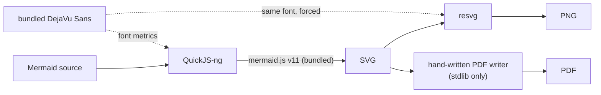

# mmdc — Mermaid Diagram Converter for Python

[](https://pypi.org/project/mmdc)
[](https://pypi.org/project/mmdc)
[](https://opensource.org/licenses/MIT)
[](https://github.com/MohammadRaziei/mmdc/actions/workflows/wheel.yml)
[](https://github.com/MohammadRaziei/mmdc/stargazers)

<div align="center">

</div>

Convert Mermaid diagrams to SVG, PNG, PDF, or ASCII art — **fully offline and fast, just `pip install mmdc`**.

**Completely browserless.** No Node.js, no npm, no Chrome, no system packages, nothing to compile. And because there's no browser to boot, `mmdc` renders noticeably faster than the official `mermaid-cli`, which drives a real headless Chrome through Puppeteer for every single diagram — `mmdc` uses a fast, embedded JS engine instead.

```bash
pip install mmdc
```

That's it — SVG, PNG, PDF, and ASCII output all work out of the box; nothing else to install.

---

## Why mmdc?

The official Mermaid CLI (`@mermaid-js/mermaid-cli`) works by spinning up a real headless Chrome via Puppeteer for every render. That works, but a full browser is slow to start and heavy to install (~170MB+ of Chromium), which shows up directly in wall-clock time — especially in CI pipelines rendering many diagrams, or anything short-lived like a serverless function.

`mmdc` renders the actual, current Mermaid v11 JS library — not a reimplementation, not a subset — but runs it inside a small embedded JavaScript engine instead of a browser. No browser process to spawn, no page to load, no DOM to boot — just the JS engine running Mermaid's own layout code directly. That's the whole speed difference in one sentence: **browser vs. no browser.**

---

## Quick Start

```python
import mmdc

d = mmdc.render("""
graph TD
    A[Install] --> B[Import]
    B --> C[Convert]
    C --> D[Done]
""")

d.save("diagram.svg")
d.save("diagram.png", scale=2.0)
d.save("diagram.pdf", pdf_format="A4")
print(d.ascii())
```

```bash
mmdc -i diagram.mermaid -o diagram.svg
mmdc -i diagram.mermaid -o diagram.png --scale 2.0
cat diagram.mermaid | mmdc -i - -o diagram.pdf
```

---

## How It Works



Everything happens in one process, no subprocess, no I/O:

- **SVG** — mermaid.js runs inside QuickJS-ng against a minimal fake DOM/SVG implementation. The one thing a fake DOM can't fabricate — real text metrics (`getBBox`/`getComputedTextLength`) — is bridged back into Python, which reads real glyph widths from a bundled font.
- **PNG** — the SVG is rasterized by [resvg](https://pypi.org/project/resvg_py/), forced to use that *same* bundled font, so what mermaid measured during layout is exactly what gets painted.
- **PDF** — a small hand-written PDF writer (stdlib `zlib`/`struct` only) embeds the rendered pixels directly. No Pillow, no Cairo, no reportlab — every mainstream "put an image in a PDF" library pulls in Pillow as a transitive dependency; this avoids that entirely.
- **ASCII** — a completely separate, lightweight path via [termaid](https://pypi.org/project/termaid/) (pure Python, ~700KB, zero dependencies), which parses the Mermaid source itself rather than going through the SVG.

Rendering is CPU-bound, synchronous, single-process — there's no browser or subprocess to wait on, so there's nothing for `async` to usefully overlap. See [`mmdc.render_many()`](#parallel-batch-rendering) below for real parallelism instead.

---

## Python API

### `render(source, backend=None, **opts) -> Diagram`

```python
import mmdc

d = mmdc.render("flowchart LR; A-->B-->C")
```

`render()` itself does nothing but store the source — every `Diagram` method below is **lazy and cached**: nothing is computed until you call it, and calling it again with the same arguments returns the memoized result instead of recomputing.

| Method | Returns | Notes |
|---|---|---|
| `.svg()` | `str` | Computed on first call, cached after |
| `.png(width?, height?, scale?, background?)` | `bytes` | Aspect ratio always preserved |
| `.pdf(pdf_format?, pdf_landscape?, pdf_margin?, width?, height?, scale?, background?)` | `bytes` | `pdf_format=None` (default) fits the page to the diagram |
| `.ascii(**opts)` | `str` | Renders straight from the Mermaid source, doesn't need `.svg()` first |
| `.raw(width?, height?, background?)` | `(bytes, w, h)` | Raw RGBA8888, no imaging library involved |
| `.numpy(width?, height?, background?)` | `np.ndarray` | `(H, W, 4)` uint8; requires `numpy` |
| `.save(path, format=None, ...)` | `None` | Format from `format=`, or inferred from the extension otherwise |
| `._repr_svg_()` | `str` | Automatic inline rendering in Jupyter/IPython |

```python
d.svg() is d.svg()      # True -- second call is a cache hit, not a re-render
d.png(width=1200, background="#ffffff")
d.raw()                 # (bytes, width, height) -- RGBA8888
d.numpy()                # np.ndarray, no Pillow needed
d.ascii()                # ASCII/Unicode box-drawing art
d.save("out.pdf", pdf_format="A4", pdf_margin="1cm")
```

### `save()`: format from the extension, or forced explicitly

```python
d.save("out.svg")                       # -> svg
d.save("out.png")                       # -> png
d.save("out.pdf")                       # -> pdf
d.save("out.txt")                       # -> ascii
d.save("out.whatever", format="png")    # force a format regardless of extension
```

### Themes, config, CSS

```python
mmdc.render(source, theme="dark")                    # "default" | "forest" | "dark" | "neutral"
mmdc.render(source, config={"flowchart": {"curve": "basis"}})
mmdc.render(source, css=".node rect { rx: 8; ry: 8; }")
```

### Parallel batch rendering

Rendering is pure CPU work — no I/O to overlap, so real concurrency means real processes, not `async`:

```python
diagrams = mmdc.render_many(sources, workers=4, theme="dark")
for d, name in zip(diagrams, output_names):
    d.save(name)
```

Each worker process starts its own persistent engine once and reuses it for every diagram routed to it.

### ASCII / terminal output

Works out of the box — [termaid](https://pypi.org/project/termaid/) (pure Python, ~700KB, zero dependencies of its own) is a core dependency, not an optional extra:

```python
print(mmdc.render_ascii("graph LR; A-->B-->C"))
# or, equivalently: mmdc.render("graph LR; A-->B-->C").ascii()
```
```
┌───┐    ┌───┐    ┌───┐
│ A ├───►│ B ├───►│ C │
└───┘    └───┘    └───┘
```

### Low-level utilities

Rasterize any SVG string directly, without going through `render()`:

```python
from mmdc import svg_to_png, svg_to_raw

svg = open("diagram.svg").read()
png = svg_to_png(svg, width=1200, background="#ffffff")
raw, w, h = svg_to_raw(svg)
```

### Additional backends (optional)

```bash
pip install mmdc[rust]
```

If [`mmdr`](https://github.com/mohammadraziei/mmdr) (a native-Rust Mermaid renderer) is installed, its backends become available too — same `Diagram` interface either way:

```python
mmdc.backends()
# ['js']                                   # mmdr not installed
# ['js', 'merman', 'mermaid-rs-renderer']   # mmdr installed

mmdc.render(source, backend="merman")   # returns mmdr's own Diagram directly
```

---

## CLI

```bash
# SVG to stdout (no -o needed)
mmdc -i diagram.mermaid
cat diagram.mermaid | mmdc -i -

# save to file (format from extension)
mmdc -i diagram.mermaid -o diagram.svg
mmdc -i diagram.mermaid -o diagram.png
mmdc -i diagram.mermaid -o diagram.pdf

# size
mmdc -i diagram.mermaid -o diagram.png -w 1200
mmdc -i diagram.mermaid -o diagram.png --scale 2.0

# theme & background
mmdc -i diagram.mermaid -o diagram.svg --theme dark
mmdc -i diagram.mermaid -o diagram.png --background "#f5f5f5"

# PDF options
mmdc -i diagram.mermaid -o diagram.pdf --pdf-format A4 --landscape --margin 1cm

# config & CSS
mmdc -i diagram.mermaid -o diagram.svg --config config.json --css style.css

# info — Mermaid library version
mmdc --info

# version
mmdc --version
```

---

## Supported Diagram Types

Everything Mermaid v11 itself supports (this bundles the real library, not a subset):
flowcharts, sequence diagrams, class diagrams, state diagrams, ER diagrams, Gantt charts,
pie charts, git graphs, and more.

---

## Requirements

- Python 3.9+
- `quickjs-ng`, `resvg_py`, `termaid` (installed automatically)
- No system packages, no Node.js, no npm, no browser

---

## Testing

```bash
pip install -e ".[test]"
pytest tests/ -v
```

`tests/test_online_comparison.py` structurally cross-checks output against [mermaid.ink](https://mermaid.ink) (labels + aspect ratio, not pixel-diffing — two different rendering engines never match pixel-for-pixel). It needs outbound internet access and skips itself gracefully if that's unavailable or the service returns a transient error.

---

## Acknowledgments

- [Mermaid](https://github.com/mermaid-js/mermaid) — the actual diagramming library this project renders. `mmdc` wouldn't exist without it; all it does is run the real thing somewhere a browser can't go.
- [mmdr](https://github.com/mohammadraziei/mmdr) — a native-Rust Mermaid renderer by the same author, usable as an additional backend here (see [Additional backends](#additional-backends-optional)).
- [termaid](https://pypi.org/project/termaid/) — powers ASCII/Unicode terminal output.

---

## Contributing

1. Fork and create a feature branch
2. Add tests for new functionality
3. Run `pytest tests/` — all must pass
4. Open a pull request

---

## License

MIT — see [LICENSE](LICENSE) for details.

If `mmdc` saves you from booting a headless Chrome instance a hundred times in CI, consider leaving a ⭐ on the repo — it genuinely helps others find the project.

---

<div align="center">
Made by <a href="https://github.com/MohammadRaziei">Mohammad Raziei</a>
</div>
