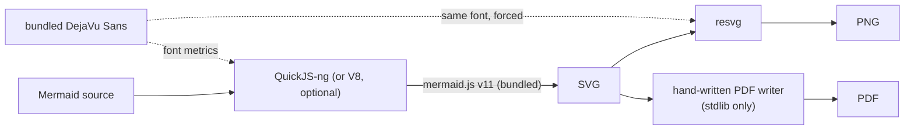

# MermaidX — Mermaid Diagram Converter for Python

[](https://pypi.org/project/mermaidx)
[](https://pypi.org/project/mermaidx)
[](https://opensource.org/licenses/MIT)
[](https://github.com/MohammadRaziei/mermaidx/actions/workflows/wheel.yml)
[](https://github.com/MohammadRaziei/mermaidx/stargazers)

<div align="center">

</div>

Convert Mermaid diagrams to SVG, PNG, PDF, or ASCII art — **fully offline and fast, just `pip install mermaidx`**.

**Completely browserless.** No Node.js, no npm, no Chrome, no system packages, nothing to compile. And because there's no browser to boot, `mermaidx` renders noticeably faster than the official `mermaid-cli`, which drives a real headless Chrome through Puppeteer for every single diagram — `mermaidx` uses a fast, embedded JS engine instead.

---

## Installation

`mermaidx` is published on [PyPI](https://pypi.org/project/mermaidx) as prebuilt wheels. It is entirely contained within the Python ecosystem — **zero system dependencies, no system Node/Mermaid binaries, no browser, and no C/C++ compilers required.**

### Base Install
SVG, PNG, PDF, and ASCII output work fully out of the box with zero extra configuration:
```bash
pip install mermaidx
```

### Optional Extras

Everything beyond the base installation is opt-in via standard PyPI extras:

| Command | Adds |
| --- | --- |
| `pip install mermaidx` | Base install — default `backend="quickjs"`, zero system dependencies |
| `pip install mermaidx[v8]` | Real V8 engine (`mini-racer`) as a selectable `backend="v8"` (2-4.5x faster JIT) |
| `pip install mermaidx[rust]` | Native-Rust backends via [`mmdr`](https://github.com/mohammadraziei/mmdr) — `backend="merman"`, `backend="mermaid-rs-renderer"` |
| `pip install mermaidx[embed]` | `fontTools`, enabling `.svg(embed_font=True)` for standalone browser-safe SVGs |
| `pip install numpy` | Adds `.numpy()` export support (standard package dependency) |
| `pip install mermaidx[all]` | Every extra above (`v8` + `rust` + `embed` + `numpy`) in one go |

- **V8 Speedup & Behavior:** V8 renders **2–4.5x faster** (byte-for-byte identical SVG) by leveraging JIT compilation. It runs in an isolated child process to ensure 100% memory reclamation.
- **Mindmap Exception:** For `mindmap` diagrams, use the default `backend="quickjs"`. Cytoscape animation loops require QuickJS-ng's execution bounding; under `V8`, mindmaps raise an error and clean up the process safely without leaking memory.

---

## Available Backends

`mermaidx` normalizes every backend under a single unified API (`DiagramBase`). Check currently available backends programmatically at runtime:

```python
import mermaidx

print(mermaidx.backends())
# ['quickjs']                                    # Base install
# ['quickjs', 'v8']                               # with mermaidx[v8]
# ['quickjs', 'merman', 'mermaid-rs-renderer']     # with mermaidx[rust]
```

### Backend Comparison Table

| Backend | Engine Type | Features & Performance |
| --- | --- | --- |
| `quickjs` *(default)* | Embedded JS (QuickJS-ng) | Lightweight, zero-config, always available. Runs real `mermaid.js` in-process. Safe for all diagram types (including `mindmap`). |
| `v8` | Real V8 JIT (`mini-racer`) | **2–4.5x faster** JIT execution for large diagrams. Byte-for-byte identical SVG output.¹ |
| `merman` | Native Rust (`mmdr`) | Pure Rust implementation — no JavaScript engine involved.² |
| `mermaid-rs-renderer` | Native Rust (`mmdr`) | Alternative pure-Rust renderer from `mmdr`.² |

¹ Except `mindmap` — see the Mindmap Exception note above; `v8` falls back to `quickjs` there, in a separate child process so a stuck render can't leak memory.
² Every backend shares the same `mermaidx` `DiagramBase` — only `svg()` differs per backend, everything downstream of it (PNG/PDF/raw/numpy) is the same resvg + PDF-writer pipeline for all of them, so PDF/raw/numpy come along for free here too.

```python
# Unified interface regardless of backend:
d = mermaidx.render(source, backend="merman")
d.pdf()  # Works flawlessly, bridging mmdr's SVG into mermaidx's PDF engine
```

There isn't really an equivalent to this in the Python ecosystem. Every other Mermaid-to-image tool reachable from Python — including the official `mermaid-cli` itself — works by driving an actual browser (Puppeteer/Chrome) or shelling out to a separate Node.js process. `mermaidx` is the only one that renders real, current Mermaid JS with no browser and no subprocess at all.

> **Looking for `mmdc`?** That was this project's old name, renamed to `mermaidx` — see [History](#history) for why. `mmdc` is no longer published or maintained under that name; install `mermaidx` instead.

---

## Why mermaidx?

The official Mermaid CLI (`@mermaid-js/mermaid-cli`) works by spinning up a real headless Chrome via Puppeteer for every render. That works, but a full browser is slow to start and heavy to install (~170MB+ of Chromium), which shows up directly in wall-clock time — especially in CI pipelines rendering many diagrams, or anything short-lived like a serverless function.

`mermaidx` renders the actual, current Mermaid v11 JS library — not a reimplementation, not a subset — but runs it inside a small embedded JavaScript engine instead of a browser. No browser process to spawn, no page to load, no DOM to boot — just the JS engine running Mermaid's own layout code directly. That's the whole speed difference in one sentence: **browser vs. no browser.**

---

## Quick Start

[](https://colab.research.google.com/github/mohammadraziei/mermaidx/blob/master/examples/jupyter_demo.ipynb)

```python
import mermaidx

d = mermaidx.render("""
graph TD
    A[Install] --> B[Import]
    B --> C[Convert]
    C --> D[Done]
""")

d.save("diagram.svg")
d.save("diagram.png", scale=2.0)
d.save("diagram.pdf", pdf_format="A4")
print(d.ascii())
```

```bash
mermaidx -i diagram.mermaid -o diagram.svg
mermaidx -i diagram.mermaid -o diagram.png --scale 2.0
cat diagram.mermaid | mermaidx -i - -o diagram.pdf
```

---

## Jupyter

A `Diagram` displays automatically as the last expression in a cell — no extra code needed, the same way a DataFrame or a matplotlib figure does:

```python
import mermaidx
mermaidx.render("flowchart LR; A-->B-->C")   # just shows up
```

`.show()` displays it explicitly (e.g. inside a loop) — it always shows exactly what `.svg()` returns, so what you see is this package's own render output, not a separate re-render through some other engine.

See [`examples/jupyter_demo.ipynb`](examples/jupyter_demo.ipynb) for a full walkthrough: display, PNG/PDF/ASCII export, themes, and batch rendering.

---

## How It Works



Everything happens in one process, no subprocess, no I/O — with one deliberate exception, `backend="v8"`, noted below.

* **SVG** — mermaid.js runs inside QuickJS-ng (default, in-process) or, optionally, real V8 (`backend="v8"`, in its own child process) against a minimal fake DOM/SVG implementation. The one thing a fake DOM can't fabricate — real text metrics (`getBBox`/`getComputedTextLength`) — is bridged back into Python (QuickJS) or reproduced exactly from a precomputed per-glyph advance-width table (V8), both reading the same bundled font.
* **PNG** — the SVG is rasterized by [resvg](https://pypi.org/project/resvg_py/), forced to use that *same* bundled font, so what mermaid measured during layout is exactly what gets painted.
* **PDF** — a small hand-written PDF writer (stdlib `zlib`/`struct` only) embeds the rendered pixels directly. No Pillow, no Cairo, no reportlab — every mainstream "put an image in a PDF" library pulls in Pillow as a transitive dependency; this avoids that entirely.
* **ASCII** — a completely separate, lightweight path via [termaid](https://pypi.org/project/termaid/) (pure Python, ~700KB, zero dependencies), which parses the Mermaid source itself rather than going through the SVG.

Rendering is CPU-bound, synchronous — there's no browser to wait on, so there's nothing for `async` to usefully overlap. See [`mermaidx.render_many()`](#parallel-batch-rendering) below for real parallelism instead.

Every backend is a small subclass of one shared `DiagramBase` — `Diagram` for `'quickjs'`/`'v8'`, `DiagramRust` for anything from the optional `mmdr` package. Subclasses only override the private `_svg()` hook; the public, cached `svg()`/`png()`/`pdf()`/`raw()`/`numpy()`/`ascii()`/`save()` are all written once in the base class and work identically regardless of which backend produced the SVG.

---

## Python API

### `render(source, backend=None, **opts) -> Diagram`

```python
import mermaidx

d = mermaidx.render("flowchart LR; A-->B-->C")
```

`render()` itself does nothing but store the source — every `Diagram` method below is **lazy and cached**: nothing is computed until you call it, and calling it again with the same arguments returns the memoized result instead of recomputing.

| Method | Returns | Notes |
| --- | --- | --- |
| `.svg()` | `str` | Computed on first call, cached after |
| `.png(width?, height?, scale?, background?)` | `bytes` | Aspect ratio always preserved |
| `.pdf(pdf_format?, pdf_landscape?, pdf_margin?, width?, height?, scale?, background?)` | `bytes` | `pdf_format=None` (default) fits the page to the diagram |
| `.ascii(**opts)` | `str` | Renders straight from the Mermaid source, doesn't need `.svg()` first |
| `.raw(width?, height?, background?)` | `(bytes, w, h)` | Raw RGBA8888, no imaging library involved |
| `.numpy(width?, height?, background?)` | `np.ndarray` | `(H, W, 4)` uint8; requires `numpy` |
| `.save(path, format=None, ...)` | `None` | Format from `format=`, or inferred from the extension otherwise |
| `._repr_svg_()` | `str` | Automatic inline rendering in Jupyter/IPython |

```python
d.svg() is d.svg()      # True -- second call is a cache hit, not a re-render
d.png(width=1200, background="#ffffff")
d.raw()                 # (bytes, width, height) -- RGBA8888
d.numpy()                # np.ndarray, no Pillow needed
d.ascii()                # ASCII/Unicode box-drawing art
d.save("out.pdf", pdf_format="A4", pdf_margin="1cm")
```

### `save()`: format from the extension, or forced explicitly

```python
d.save("out.svg")                       # -> svg
d.save("out.png")                       # -> png
d.save("out.pdf")                       # -> pdf
d.save("out.txt")                       # -> ascii
d.save("out.whatever", format="png")    # force a format regardless of extension
```

### Themes, config, CSS

```python
mermaidx.render(source, theme="dark")                    # "default" | "forest" | "dark" | "neutral"
mermaidx.render(source, config={"flowchart": {"curve": "basis"}})
mermaidx.render(source, css=".node rect { rx: 8; ry: 8; }")
```

### Parallel batch rendering

Rendering is pure CPU work — no I/O to overlap, so real concurrency means real processes, not `async`:

```python
diagrams = mermaidx.render_many(sources, workers=4, theme="dark")
for d, name in zip(diagrams, output_names):
    d.save(name)
```

Each worker process starts its own persistent engine once and reuses it for every diagram routed to it.

### ASCII / terminal output

Works out of the box — [termaid](https://pypi.org/project/termaid/) (pure Python, ~700KB, zero dependencies of its own) is a core dependency, not an optional extra:

```python
print(mermaidx.render_ascii("graph LR; A-->B-->C"))
# or, equivalently: mermaidx.render("graph LR; A-->B-->C").ascii()
```

```
┌───┐    ┌───┐    ┌───┐
│ A ├───►│ B ├───►│ C │
└───┘    └───┘    └───┘
```

### Embedding the font for browser-accurate SVGs (optional)

`.png()`/`.pdf()` always paint with exactly the font `mermaidx` measured with (see [How It Works](#how-it-works)), so they're guaranteed accurate. Opening the raw `.svg()` output directly in a browser is a different story: the SVG's own CSS just names a font (e.g. `"trebuchet ms"`), and the browser substitutes whatever it has installed for that name — not necessarily the same one `mermaidx` measured with — which can leave slightly mismatched whitespace around labels.

```bash
pip install mermaidx[embed]   # adds fontTools, used only for this
```

```python
d = mermaidx.render(source)
d.svg()                        # small, portable — fine for .png()/.pdf(), for embedding in
                                # something with its own CSS, or for most SVG viewers
d.svg(embed_font=True)         # bigger, but paints correctly in a plain browser tab too
d.save("diagram.svg", embed_font=True)
```

This subsets the bundled font down to just the glyphs this particular diagram uses and inlines them as a base64 `@font-face`, registered under the same family name the diagram's own CSS already asks for — so it wins the browser's font lookup without needing to touch that CSS. Off by default since it needs `fontTools` and makes the file bigger; use it only when you know the SVG will be opened on its own, outside of `mermaidx`'s own rendering pipeline. Also available from the CLI as `--embed-font` (SVG output only).

### Low-level utilities

Rasterize any SVG string directly, without going through `render()`:

```python
from mermaidx import svg_to_png, svg_to_raw

svg = open("diagram.svg").read()
png = svg_to_png(svg, width=1200, background="#ffffff")
raw, w, h = svg_to_raw(svg)
```

---

## CLI

```bash
# SVG to stdout (no -o needed)
mermaidx -i diagram.mermaid
cat diagram.mermaid | mermaidx -i -

# save to file (format from extension)
mermaidx -i diagram.mermaid -o diagram.svg
mermaidx -i diagram.mermaid -o diagram.png
mermaidx -i diagram.mermaid -o diagram.pdf

# size
mermaidx -i diagram.mermaid -o diagram.png -w 1200
mermaidx -i diagram.mermaid -o diagram.png --scale 2.0

# theme & background
mermaidx -i diagram.mermaid -o diagram.svg --theme dark
mermaidx -i diagram.mermaid -o diagram.png --background "#f5f5f5"

# PDF options
mermaidx -i diagram.mermaid -o diagram.pdf --pdf-format A4 --landscape --margin 1cm

# config & CSS
mermaidx -i diagram.mermaid -o diagram.svg --config config.json --css style.css

# browser-accurate SVG (requires mermaidx[embed]) & suppress the "saved to..." message
mermaidx -i diagram.mermaid -o diagram.svg --embed-font
mermaidx -i diagram.mermaid -o diagram.svg -q

# info — Mermaid library version
mermaidx --info

# list available backends
mermaidx --list-backends

# pick a backend explicitly (quickjs/v8 always/optionally available; anything
# else requires mermaidx[rust])
mermaidx -i diagram.mermaid -o diagram.svg --backend merman

# version
mermaidx --version   # or -v
```

---

## Supported Diagram Types

Everything Mermaid v11 itself supports (this bundles the real library, not a subset):
flowcharts, sequence diagrams, class diagrams, state diagrams, ER diagrams, Gantt charts,
pie charts, git graphs, and more.

---

## Requirements

* Python 3.9+
* `quickjs-ng`, `resvg_py`, `termaid` (installed automatically)
* `mini-racer` (optional, `pip install mermaidx[v8]`, for the V8 engine)
* No system packages, no Node.js, no npm, no browser

---

## Testing

```bash
pip install -e ".[test]"
pytest tests/ -v
```

---

## History

* **mmdc, powered by [phasma**](https://github.com/mohammadraziei/phasma) — the original version of this project. It bundled a real (if small — around 20MB) headless browser, PhantomJS, and exposed an `async` Python API to match: rendering meant talking to a subprocess, so `async`/`await` genuinely mattered for concurrency.
* **0.6.x** — a full rewrite: PhantomJS's engine couldn't parse modern Mermaid (v11's ES2022+ syntax) at all, so the whole browser was replaced with mermaid.js running inside QuickJS-ng against a hand-written DOM/SVG shim, with resvg for rasterization. No subprocess left to wait on, so the API became synchronous. Three backends appeared: `js` (this engine), plus `merman` and `mermaid-rs-renderer` via the optional [`mmdr`](https://github.com/mohammadraziei/mmdr) package.
* **0.7.x, renamed to mermaidx** — same engine, new name. The old name, `mmdc`, was identical to the official Mermaid CLI's own binary name (`@mermaid-js/mermaid-cli` installs a command called `mmdc`) — a real collision, not just a branding concern. Renamed early, while it still could be. **If you have `mmdc` pinned anywhere (`requirements.txt`, a Dockerfile, CI config), switch it to `mermaidx` — the old name isn't maintained or published anymore.**
* **Later 0.7.x** — the embedded-JS-engine backend split into `mermaidx/engines/` (`quickjs_engine.py` / `v8_engine.py`), and gained an optional real-V8 path (`pip install mermaidx[v8]`, `backend="v8"`) alongside the original QuickJS-ng one (`backend="quickjs"`, still the default) — same mermaid.js, same output, just a choice of engine.

---

## Acknowledgments

* [Mermaid](https://github.com/mermaid-js/mermaid) — the actual diagramming library this project renders. `mermaidx` wouldn't exist without it; all it does is run the real thing somewhere a browser can't go.
* [mmdr](https://github.com/mohammadraziei/mmdr) — a native-Rust Mermaid renderer by the same author, usable as an additional backend here.
* [termaid](https://pypi.org/project/termaid/) — powers ASCII/Unicode terminal output.

---

## Contributing

1. Fork and create a feature branch
2. Add tests for new functionality
3. Run `pytest tests/` — all must pass
4. Open a pull request

---

## License

MIT — see [LICENSE](LICENSE) for details.

If `mermaidx` saves you from booting a headless Chrome instance a hundred times in CI, consider leaving a ⭐ on the repo — it genuinely helps others find the project.