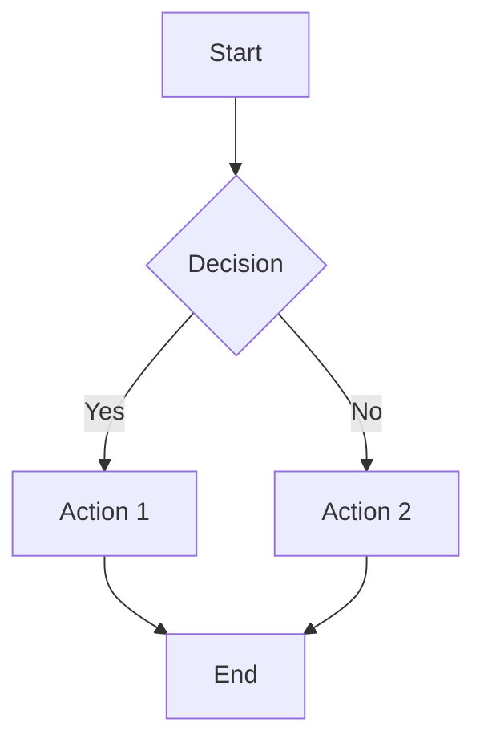
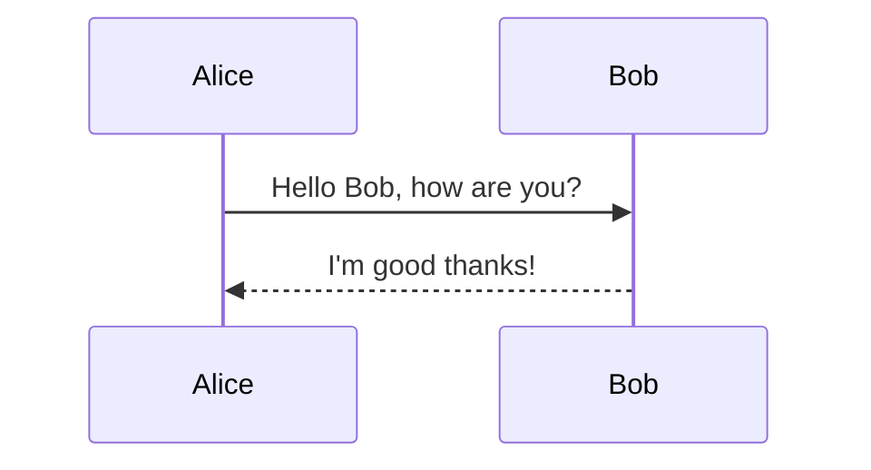
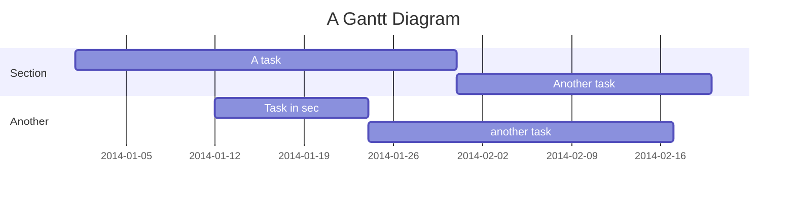
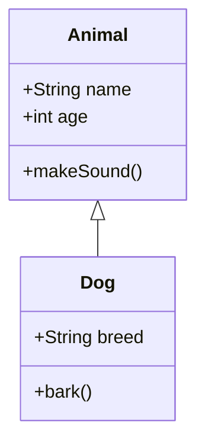
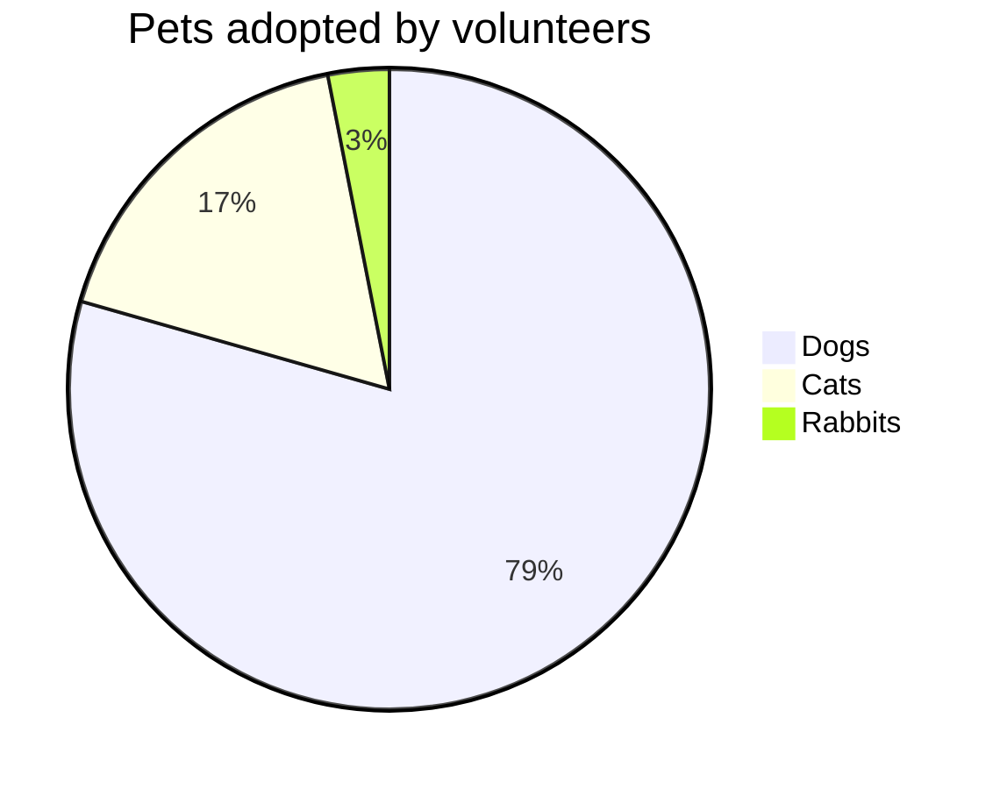

# Examples

## Basic Flowchart

Create a file `flowchart.mermaid`:



Convert to different formats:

```bash
# To SVG
mmdc --input flowchart.mermaid --output flowchart.svg

# To PNG
mmdc --input flowchart.mermaid --output flowchart.png

# To PDF
mmdc --input flowchart.mermaid --output flowchart.pdf
```

## Sequence Diagram

Create a file `sequence.mermaid`:



Convert to different formats:

```bash
mmdc --input sequence.mermaid --output sequence.png
```

## Gantt Chart

Create a file `gantt.mermaid`:



Convert with custom timeout for complex diagrams:

```bash
mmdc --input gantt.mermaid --output gantt.pdf --timeout 60
```

## Class Diagram

Create a file `class.mermaid`:



Convert to PNG with custom styling:

```bash
mmdc --input class.mermaid --output class.png --width 800 --height 600
```

## Pie Chart

Create a file `pie.mermaid`:



Convert to SVG:

```bash
mmdc --input pie.mermaid --output pie.svg
```